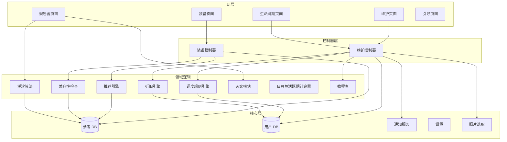

# GoCasting — 架构脊柱

## 范式

**功能优先的模块化单体** — 一个 Flutter 应用，具有严格的模块边界。每个功能模块（gear、maintenance、planner）拥有自己的 UI、逻辑和数据访问。共享基础设施（数据库、通知、设置）位于 `core` 层。不存在网络层。

## 架构决策

### AD-1: 不使用地图瓦片 [已采纳]
自定义海滩位置使用坐标输入（经纬度）配合可搜索海滩列表。不打包离线地图瓦片。节省 30-50MB 应用大小。
- **约束：** 海滩选择 UX 为列表搜索 + 手动坐标输入
- **防止：** 包大小膨胀、地图渲染复杂性、瓦片更新负担
- **规则：** 不使用地图组件。位置为文本 + 坐标。

### AD-2: 仅 NOAA 潮汐数据（V1）[已采纳]
潮汐预测使用 NOAA 公开的美国沿海站点谐波常数。其他地区推迟。
- **约束：** 潮汐精度仅保证美国海岸
- **防止：** 外国水文局许可问题
- **规则：** 潮汐模块必须数据源无关（替换常数文件，算法不变）

### AD-3: GetX 状态管理 [已采纳]
GetX 用于状态管理、路由和依赖注入。
- **约束：** 所有状态通过 Controller 暴露；UI 重建通过 Obx 实现
- **防止：** 过度工程化；全局单例反模式
- **规则：** UI 不直接修改状态。Controller 拥有所有业务逻辑。

### AD-4: Drift SQLite 抽象 [已采纳]
Drift（原 Moor）用于所有 SQLite 操作，提供编译时查询验证。
- **约束：** 所有 DB 访问通过生成的代码；功能代码禁止原生 SQL
- **防止：** 运行时 SQL 错误、schema 漂移、无类型数据
- **规则：** Schema 变更需要迁移策略；不得就地修改表。

### AD-5: 双数据库分离 [已采纳]
两个 SQLite 文件：`reference.db`（只读，应用包内）和 `user.db`（可写，应用文档目录）。
- **约束：** 参考数据（装备目录、潮汐常数、海滩）以不可变方式在 assets 中发布；用户数据（库存、日志、偏好）独立可写
- **防止：** 参考数据意外损坏；简化应用更新（整体替换 reference.db）
- **规则：** 功能代码不得对 reference.db 打开写事务。

### AD-6: 纯 Dart 天文计算 [已采纳]
月相、日出/日落、日月鱼活跃期在 Dart 中计算。不使用原生插件、不使用平台通道。
- **约束：** 跨平台结果完全一致；可作为纯函数测试
- **防止：** 平台特定差异；原生依赖脆弱性
- **规则：** 天文模块仅导入 `dart:math` 和 `dart:core`。

### AD-7: 无网络权限 [已采纳]
iOS Info.plist 和 Android Manifest 不声明任何网络相关权限。
- **约束：** 应用不能发起任何 HTTP 调用，即使是意外的
- **防止：** 意外数据泄漏、对网络的依赖
- **规则：** pubspec.yaml 中不得包含需要 INTERNET 权限的包。CI lint 强制执行。

### AD-8: 仅本地通知 [已采纳]
`flutter_local_notifications` 用于维护提醒和保修到期提醒。无推送服务，无 FCM。
- **约束：** 通知在设备上使用精确闹钟 API 调度
- **防止：** 服务器依赖、通知送达不确定性
- **规则：** 通知调度由 core/notifications 模块统一管理；维护模块和保修模块通过该服务调度。

### AD-9: 照片本地持久化 [已采纳]（V2 新增）
收据和装备照片使用 `image_picker` 获取，拷贝到应用文档目录持久存储。
- **约束：** 照片存储在 `app_documents/gear_photos/` 目录，压缩至 1920px/85% 质量
- **防止：** 依赖外部存储权限、照片丢失
- **规则：** 数据库仅存储文件路径引用，不存储 blob。删除记录时同步删除文件。

### AD-10: Schema 迁移策略 [已采纳]（V2 新增）
user.db 使用 Drift 的 `MigrationStrategy` 处理版本升级。
- **约束：** 每次 schema 变更递增 schemaVersion；onUpgrade 中按版本号顺序执行
- **防止：** 用户数据在升级时丢失
- **规则：** V1→V2 迁移添加新列和新表，不删除或修改已有列。

---

## 项目结构

```
lib/
├── main.dart                     # 应用入口，通知初始化
├── app/
│   ├── routes.dart               # GetX 路由配置
│   ├── theme.dart                # Material 3 主题
│   ├── bindings.dart             # GetX 全局依赖注入
│   └── home_page.dart            # 底部导航主页
├── core/
│   ├── database/
│   │   ├── reference_db.dart     # 只读装备/潮汐/海滩 DB
│   │   ├── reference_db.g.dart   # Drift 生成代码
│   │   ├── user_db.dart          # 可写用户数据 DB（9 张表）
│   │   └── user_db.g.dart        # Drift 生成代码
│   ├── notifications/
│   │   └── notification_service.dart  # 统一通知服务（维护+保修）
│   ├── settings/
│   │   ├── settings_controller.dart
│   │   ├── locale_controller.dart
│   │   └── settings_screen.dart
│   └── models/                   # 共享领域模型
├── features/
│   ├── gear/
│   │   ├── data/                 # 数据访问
│   │   ├── domain/               # 推荐引擎、兼容性检查
│   │   ├── presentation/         # 向导、浏览、对比页面
│   │   └── providers/            # GetX 控制器
│   ├── maintenance/
│   │   ├── data/
│   │   │   └── maintenance_repository.dart  # 统一数据访问层
│   │   ├── domain/
│   │   │   ├── maintenance_scheduler.dart   # 维护规则引擎
│   │   │   ├── depreciation_engine.dart     # V2: 折旧/估值引擎
│   │   │   └── maintenance_tutorials.dart   # V2: 教程数据模型+内容
│   │   └── presentation/
│   │       ├── gear_detail_screen.dart      # 装备详情（集成所有卡片）
│   │       ├── add_gear_screen.dart         # 添加装备
│   │       ├── warranty_screen.dart         # V2: 保修管理
│   │       ├── photos_screen.dart           # V2: 照片/收据管理
│   │       ├── log_maintenance_dialog.dart  # V2: 维护记录（含费用）
│   │       ├── tco_analysis_screen.dart     # V2: TCO 分析
│   │       ├── valuation_card.dart          # V2: 估值卡片
│   │       ├── components_screen.dart       # V2: 零件追踪
│   │       ├── tutorials_screen.dart        # V2: 维护教程
│   │       └── service_records_screen.dart  # V2: 维修状态追踪
│   ├── planner/
│   │   ├── data/                  # 海滩 DB 访问、潮汐常数
│   │   ├── domain/                # 潮汐算法、天文计算、日月鱼活跃期
│   │   └── presentation/         # 仪表板、潮汐图
│   └── onboarding/
│       └── onboarding_screen.dart
├── l10n/                         # 本地化资源
└── shared/
    ├── widgets/                   # 可复用 UI 组件
    └── extensions/                # Dart 扩展

assets/
├── db/
│   └── reference.db              # 预构建 SQLite（装备+潮汐+海滩）
├── data/
│   ├── harmonic_constants.json   # NOAA 潮汐站数据
│   └── species.json              # 目标鱼种定义
└── images/                       # 应用图标、引导插图
```

---

## 数据架构

```mermaid
erDiagram
    %% 参考 DB（只读）
    RODS {
        int id PK
        string brand
        string model
        float length_ft
        string power
        string action
        string material
        float cast_weight_min_oz
        float cast_weight_max_oz
        string line_rating
        int price_tier
        int corrosion_rating
    }
    REELS {
        int id PK
        string brand
        string model
        int size
        float gear_ratio
        float max_drag_lb
        int line_capacity_yds
        float weight_oz
        string seal_type
        int price_tier
    }
    LINES {
        int id PK
        string brand
        string type
        int lb_test
        float diameter_mm
        int price_tier
    }
    TIDE_STATIONS {
        int id PK
        string name
        float lat
        float lon
        string harmonic_constants_json
    }
    BEACHES {
        int id PK
        string name
        string region
        float lat
        float lon
        int nearest_station_id FK
        string beach_type
        string typical_species
    }

    %% 用户 DB（可写，schema v2）
    USER_GEAR {
        int id PK
        int reference_gear_id
        string gear_type
        string custom_name
        string purchase_date
        float price_paid
        string photo_path
        string status
    }
    USAGE_LOGS {
        int id PK
        int gear_id FK
        string date
        string environment
        int duration_min
    }
    MAINTENANCE_LOGS {
        int id PK
        int gear_id FK
        string date
        string maintenance_type
        string notes
        float cost
        string cost_category
        string service_provider
    }
    GEAR_WARRANTIES {
        int id PK
        int gear_id FK
        string warranty_start_date
        int warranty_duration_months
        string warranty_expiry_date
        string provider_name
        string warranty_terms
    }
    GEAR_PHOTOS {
        int id PK
        int gear_id FK
        string photo_path
        string photo_type
        string description
    }
    SERVICE_RECORDS {
        int id PK
        int gear_id FK
        string service_provider
        string date_sent
        string estimated_return_date
        string actual_return_date
        float cost
        string status
        string notes
    }
    GEAR_COMPONENTS {
        int id PK
        int gear_id FK
        string component_name
        string component_label
        string install_date
        int usage_count
        float replacement_cost
        int maintenance_interval_sessions
        int maintenance_interval_days
        string last_maintenance_date
        string status
    }
    CUSTOM_BEACHES {
        int id PK
        string name
        float lat
        float lon
        int nearest_station_id FK
        string beach_type
    }
    USER_SETTINGS {
        string key PK
        string value
    }

    BEACHES ||--o{ TIDE_STATIONS : "最近站点"
    USER_GEAR ||--o{ USAGE_LOGS : "拥有"
    USER_GEAR ||--o{ MAINTENANCE_LOGS : "拥有"
    USER_GEAR ||--o{ GEAR_WARRANTIES : "拥有"
    USER_GEAR ||--o{ GEAR_PHOTOS : "拥有"
    USER_GEAR ||--o{ SERVICE_RECORDS : "拥有"
    USER_GEAR ||--o{ GEAR_COMPONENTS : "拥有"
    CUSTOM_BEACHES ||--o{ TIDE_STATIONS : "最近站点"
```



---

## 模块依赖图



---

## 核心技术模块

### 潮汐预测算法
- 输入：每站的谐波常数（振幅、相位、角速度）+ 目标日期时间
- 输出：预测水位
- 方法：N 个谐波分量之和：`h(t) = H₀ + Σ(Aₙ · cos(ωₙt + φₙ))`
- 实现：纯 Dart，与 NOAA 公布预测对比测试（±15min，±0.3m）
- 常数以 JSON 数组形式存储在 reference.db 中

### 推荐引擎
- 基于规则匹配（非 ML）：
  - 鱼种 → 所需竿功率/长度范围
  - 条件 → 铅坠重量 → 竿抛投重量范围
  - 预算 → 价格档次过滤
  - 距离 → 竿长度 + 线类型偏好
- 从装备 DB 输出评分候选者，每类显示前 3
- 选择后进行兼容性验证

### 维护调度器
- 按装备类型的规则表（可配置默认值）：
  ```
  装备类型 | 维护类型    | 触发次数 | 触发天数
  渔轮     | 完整维护    | 15       | 90
  渔轮     | 拖力上油    | 10       | 60
  鱼竿     | 导环检查    | 30       | 180
  钓线     | 更换        | 50       | 180
  ```
- 调度器在应用打开时检查：比较 usage_logs 计数和距上次 maintenance_log 的天数
- 阈值超过时通过 `flutter_local_notifications` 触发本地通知

### 折旧/估值引擎（V2 新增）
- 输入：原价、装备类型、使用天数、总使用次数、海水暴露率、维护评分
- 输出：当前估值、保值率、剩余寿命、状况评级
- 公式：首年贬值 + 年化磨损，受盐水暴露和维护质量调节
- 维护良好降低贬值率 20%（激励用户按时维护）
- 全部离线计算，使用打包的折旧参数表

### 通知服务（V2 增强）
- 统一管理维护提醒和保修到期提醒
- 使用 `timezone` 包处理时区感知的 `zonedSchedule`
- 保修提醒：到期前 30 天和 7 天各一次
- 按 gearId 分配通知 ID 避免冲突

---

## 技术栈

| 层 | 选择 | 版本 |
|----|------|------|
| 框架 | Flutter | 3.x stable |
| 语言 | Dart | 3.x |
| 状态管理 | GetX | ^4.7.x |
| 数据库 | Drift | ^2.22.x |
| 通知 | flutter_local_notifications | ^18.x |
| 时区 | timezone | ^0.10.x |
| 照片 | image_picker | ^1.1.x |
| 图表 | fl_chart | ^0.70.x（潮汐图 + TCO 饼图）|
| 模型 | freezed + json_serializable | latest |
| 代码生成 | build_runner + drift_dev | latest |
| 路径 | path + path_provider | latest |

---

## 推迟项

- **地图可视化** — 推迟到包大小预算允许离线瓦片时
- **非美国潮汐数据** — 推迟到确认 UKHO、BOM、LINZ 许可
- **云同步** — 推迟；需要网络权限
- **商业化钩子** — 推迟；无订阅基础设施
- **本地化字符串** — 架构支持（ARB 文件），仅发布英文内容
- **照片存储优化** — 当前存储在应用文档目录；缩略图生成推迟
- **AI 照片识别** — 拍照入库需要网络（推迟）

---

## 运营信封

| 维度 | 范围 |
|------|------|
| 部署 | App Store (iOS) + Google Play (Android) |
| 更新 | 标准应用商店发布周期；reference.db 每版本整体替换 |
| 崩溃报告 | 无（无网络）。后续版本考虑可选上报。 |
| 分析 | 无（无网络） |
| CI/CD | GitHub Actions：lint → test → build APK/IPA |
| 测试 | 单元测试（领域逻辑）+ Widget 测试（UI）+ 集成测试（DB + 控制器）|
