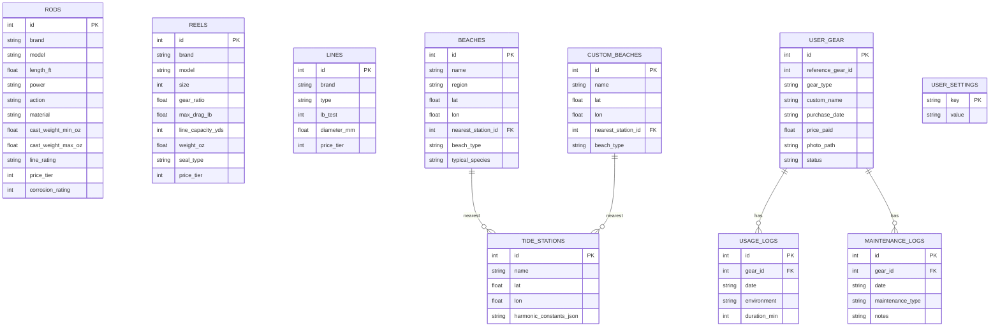
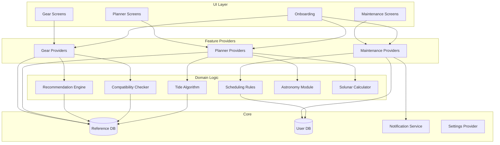

# GoCasting — Architecture Spine

## Paradigm

**Feature-first modular monolith** — a single Flutter app with strict module boundaries. Each feature (gear, maintenance, planner) owns its UI, logic, and data access. Shared infrastructure (database, notifications, settings) lives in a `core` layer. No network layer exists.

## Architecture Decisions

### AD-1: No Map Tiles [ADOPTED]
Custom beach locations use coordinate entry (lat/lon) with a searchable beach list. No offline map tile bundle. Saves 30-50MB app size.
- **Binds:** Beach selection UX is list-based search + manual coordinate input
- **Prevents:** Bundle size bloat, map rendering complexity, tile update burden
- **Rule:** No map widget in V1. Location is text + coordinates.

### AD-2: NOAA Tide Data Only (V1) [ADOPTED]
Tide predictions use NOAA published harmonic constants for US coastal stations. Other regions deferred.
- **Binds:** V1 tide accuracy guaranteed for US coasts only
- **Prevents:** Licensing issues with foreign hydrographic offices
- **Rule:** Tide module must be data-source-agnostic (swap constants file, same algorithm)

### AD-3: Riverpod State Management [ADOPTED]
Riverpod 2.x with code generation (`riverpod_generator`).
- **Binds:** All state is exposed as providers; UI rebuilds are granular
- **Prevents:** Bloc boilerplate overhead; global singleton anti-pattern
- **Rule:** No direct state mutation from UI. Providers own all business logic.

### AD-4: Drift SQLite Abstraction [ADOPTED]
Drift (formerly Moor) for all SQLite operations with compile-time query verification.
- **Binds:** All DB access through generated DAOs; raw SQL forbidden in feature code
- **Prevents:** Runtime SQL errors, schema drift, untyped data
- **Rule:** Schema changes require migration files; never alter tables in-place.

### AD-5: Dual Database Separation [ADOPTED]
Two SQLite files: `reference.db` (read-only, in app bundle) and `user.db` (writable, in app documents).
- **Binds:** Reference data (gear catalog, tide constants, beaches) ships immutable in assets; user data (inventory, logs, prefs) is independently writable
- **Prevents:** Accidental reference data corruption; simplifies app updates (replace reference.db wholesale)
- **Rule:** Feature code never opens a write transaction on reference.db.

### AD-6: Pure Dart Astronomy [ADOPTED]
Moon phase, sunrise/sunset, solunar computed in Dart. No native plugins, no platform channels for astronomy.
- **Binds:** Cross-platform identical results; testable as pure functions
- **Prevents:** Platform-specific divergence; native dependency fragility
- **Rule:** Astronomy module has zero imports outside `dart:math` and `dart:core`.

### AD-7: No Network Permission [ADOPTED]
iOS Info.plist and Android Manifest declare no network-related permissions.
- **Binds:** App cannot make any HTTP call, even accidentally
- **Prevents:** Accidental data leakage, dependency on connectivity
- **Rule:** No package in pubspec.yaml that requires INTERNET permission. CI lint enforced.

### AD-8: Local Notifications Only [ADOPTED]
`flutter_local_notifications` for maintenance reminders. No push service, no FCM.
- **Binds:** Notifications scheduled on-device with exact alarm APIs
- **Prevents:** Server dependency, notification delivery uncertainty
- **Rule:** Notification scheduling lives in maintenance module only; other modules do not schedule notifications in V1.

---

## Project Structure (Seed)

```
lib/
├── main.dart                     # App entry, provider scope, router
├── app/
│   ├── router.dart               # GoRouter configuration
│   └── theme.dart                # Material 3 theme
├── core/
│   ├── database/
│   │   ├── reference_db.dart     # Read-only gear/tide/beach DB
│   │   ├── user_db.dart          # Writable user data DB
│   │   └── migrations/           # Drift migration files
│   ├── notifications/
│   │   └── notification_service.dart
│   ├── settings/
│   │   ├── settings_provider.dart
│   │   └── units.dart            # Metric/Imperial conversion
│   └── models/                   # Shared domain models
├── features/
│   ├── gear/
│   │   ├── data/                 # DAOs, repositories
│   │   ├── domain/               # Business logic, recommendation engine
│   │   ├── presentation/         # Screens, widgets
│   │   └── providers/            # Riverpod providers
│   ├── maintenance/
│   │   ├── data/
│   │   ├── domain/               # Scheduling rules engine
│   │   ├── presentation/
│   │   └── providers/
│   └── planner/
│       ├── data/                  # Beach DB access, tide constants
│       ├── domain/                # Tide algorithm, astronomy, solunar
│       ├── presentation/          # Dashboard, tide graph
│       └── providers/
└── shared/
    ├── widgets/                   # Reusable UI components
    └── extensions/                # Dart extensions

assets/
├── db/
│   └── reference.db              # Pre-built SQLite with gear + tides + beaches
├── data/
│   ├── harmonic_constants.json   # NOAA tide station data
│   └── species.json              # Target species definitions
└── images/                       # App icons, onboarding illustrations
```

---

## Data Architecture



---

## Module Dependency Diagram



---

## Key Technical Modules

### Tide Prediction Algorithm
- Input: harmonic constants (amplitude, phase, speed) per station + target datetime
- Output: predicted water level
- Method: Sum of N harmonic constituents: `h(t) = H₀ + Σ(Aₙ · cos(ωₙt + φₙ))`
- Implementation: Pure Dart, tested against NOAA published predictions (±15min, ±0.3m)
- Constants stored as JSON arrays in reference.db per station

### Recommendation Engine
- Rule-based matching (not ML):
  - Species → required rod power/length ranges
  - Conditions → sinker weight → rod casting weight range
  - Budget → price tier filter
  - Distance → rod length + line type preference
- Outputs scored candidates from gear DB, top 3 shown per category
- Compatibility validated post-selection

### Maintenance Scheduler
- Per-gear-type rule table (configurable defaults):
  ```
  gear_type | maintenance_type | trigger_sessions | trigger_days
  reel      | full_service     | 15               | 90
  reel      | drag_grease      | 10               | 60
  rod       | guide_inspect    | 30               | 180
  line      | replacement      | 50               | 180
  ```
- Scheduler checks on app open: compares usage_logs count and days since last maintenance_log
- Fires local notification via `flutter_local_notifications` when threshold exceeded

---

## Technology Stack

| Layer | Choice | Version |
|-------|--------|---------|
| Framework | Flutter | 3.x stable |
| Language | Dart | 3.x |
| State | Riverpod | 2.x + riverpod_generator |
| Database | Drift | 2.x |
| Router | GoRouter | 14.x |
| Notifications | flutter_local_notifications | 17.x |
| Charts | fl_chart | 0.69.x (tide graphs) |
| Testing | flutter_test + mocktail | latest |
| Code Gen | build_runner + freezed | latest |

---

## Deferred

- **Map visualization** — deferred until V2 when bundle size budget allows offline tiles
- **Non-US tide data** — deferred until licensing confirmed for UKHO, BOM, LINZ
- **Cloud sync** — deferred; requires network permission
- **Monetization hooks** — deferred; no subscription infrastructure in V1
- **Localization strings** — architecture supports it (ARB files), but only English content shipped
- **Photo storage optimization** — V1 stores in app documents; compression/thumbnail deferred

---

## Operational Envelope

| Dimension | V1 Scope |
|-----------|----------|
| Deployment | App Store (iOS) + Google Play (Android) |
| Updates | Standard app store release cycle; reference.db replaced wholesale per release |
| Crash reporting | None in V1 (no network). Consider in V2 with opt-in. |
| Analytics | None (no network) |
| CI/CD | GitHub Actions: lint → test → build APK/IPA |
| Testing | Unit (domain logic) + Widget (UI) + Integration (DB + providers) |
